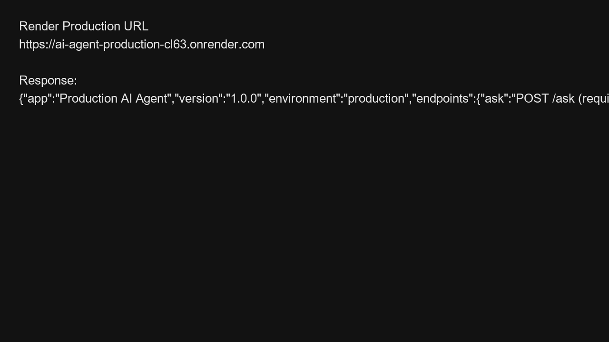
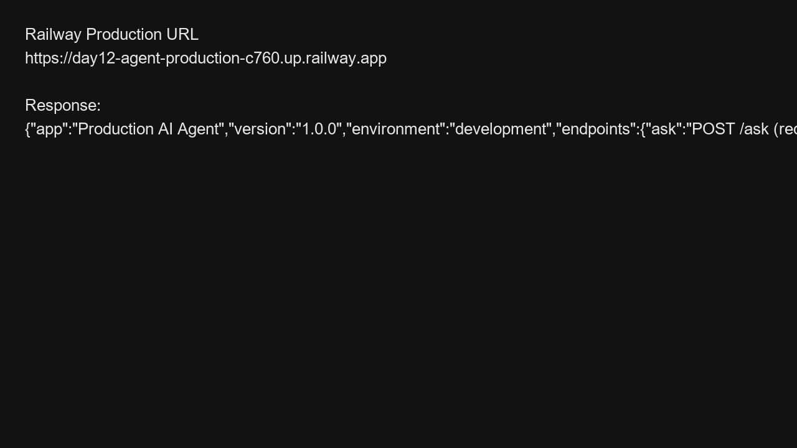

# Báo cáo thực hiện

## 1. Các link đã kiểm tra

- Render production: https://ai-agent-production-cl63.onrender.com
- Railway production: https://day12-agent-production-c760.up.railway.app

## 2. Nội dung kiểm tra

- Truy cập URL Render và Railway để xác nhận dịch vụ đang chạy.
- Kết quả trả về là một JSON thông tin ứng dụng, ví dụ:
  - `app`: "Production AI Agent"
  - `version`: "1.0.0"
  - `environment`: "production" hoặc "development"
  - `endpoints`: `ask`, `health`, `ready`

## 3. Tài liệu minh họa

Dưới đây là hai ảnh minh họa kết quả kiểm tra:

### 3.1. Render

### 3.2. Railway

## 4. Ghi chú

- Ảnh hiển thị kết quả JSON trả về từ cả hai dịch vụ.
- File ảnh nằm cùng thư mục với báo cáo.
